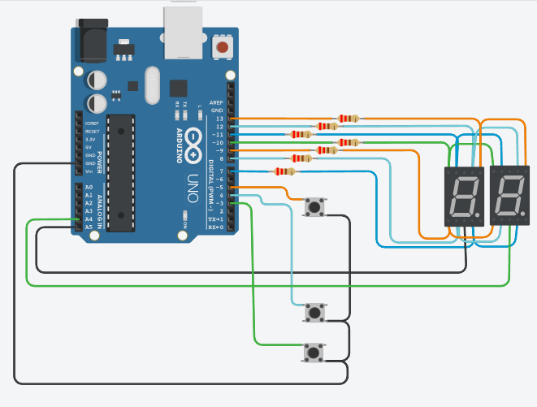
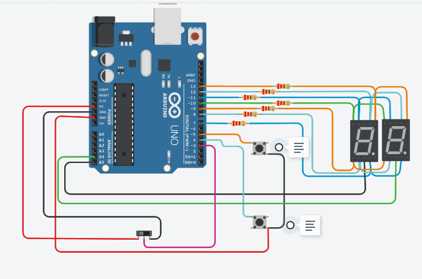
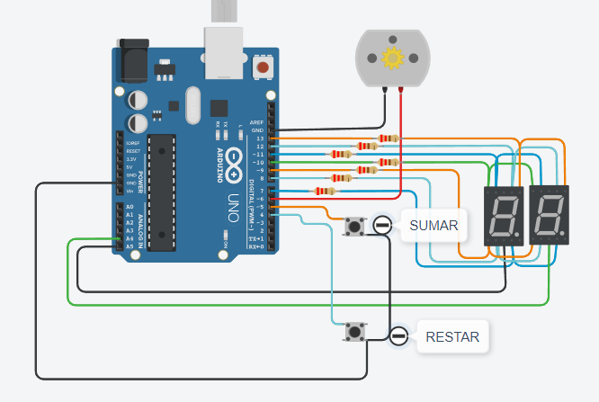
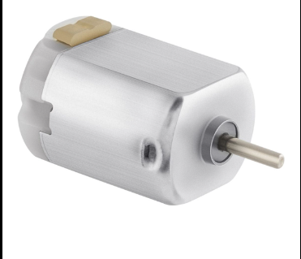
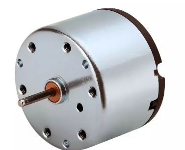
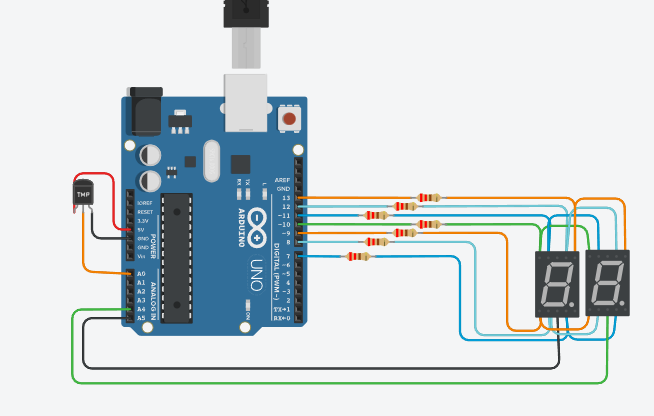
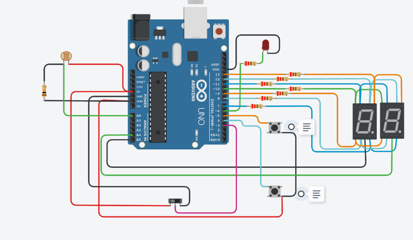

# SPD_PROYECTO_2
Proyecto numero 2 para SPD, usando tinkercad y arduino (C++): CONTADOR CON DOS DISPLAY DE 7 SEGMENTOS.
## Integrantes
- Ramiro Bianucci
## Proyecto: CONTADOR CON DOS DISPLAY DE 7 SEGMENTOS.

El proyecto consiste en dos display que cuentan del 0 a 99, cuenta con tres botones
uno para contar hacia adelante, otro para contar hacia atras y la puesta a cero, los displays no pasan del 99 y cuando lo hacen
vuelven a cero.

## Función principal "contador":
Hay dos funciones elementales en este proyecto, ya que es necesario contar con un apagado y encendido constante de cada display.
El arduino cuenta con pines limitados haciendo que sea necesario el uso de apagados y encendidos imperceptibles a la vista.
~~~ C
//ALTERNA APAGADO Y ENCENDIDO DE LOS DOS DISPLAYS
  cuentaDispUnidad(cont);
  digitalWrite(GND_UNI,LOW);
  delay(10);
  digitalWrite(GND_UNI,HIGH);
  cuentaDispDec(cont);
  digitalWrite(GND_DEC,LOW);
  delay(10);
  digitalWrite(GND_DEC,HIGH);

//SACA LA DECENA DEL CONTADOR Y LA MUESTRA
int cuentaDispDec(int num){
  
  int dispDec = (num/10)%10;
  muestraDisplay(dispDec);
}

//SACA LA UNIDAD DEL CONTADOR Y LA MUESTRA
int cuentaDispUnidad(int num){
  
  int dispUni = num%10;
  muestraDisplay(dispUni);
}
~~~

## Función principal "Encendido y muestra numero":
~~~C
//Muestra digito en display
  int muestraDisplay(int numero) {
    switch(numero) {
      
      case 0:
            digitalWrite(A,HIGH);
            digitalWrite(B,HIGH);
            digitalWrite(C,HIGH);
            digitalWrite(D,HIGH);
            digitalWrite(E,HIGH);
            digitalWrite(F,HIGH);
            digitalWrite(G,LOW);
         break;
       case 1:
      	 digitalWrite(A,LOW);
         digitalWrite(B,HIGH);
         digitalWrite(C,HIGH);
         digitalWrite(D,LOW);
         digitalWrite(E,LOW);
         digitalWrite(F,LOW);
         digitalWrite(G,LOW);
      
 
         break; 
       case 2:
         digitalWrite(A,HIGH);
         digitalWrite(B,HIGH);
         digitalWrite(C,LOW);
         digitalWrite(D,HIGH);
         digitalWrite(E,HIGH);
         digitalWrite(F,LOW);
         digitalWrite(G,HIGH);
         break;
       case 3:
         digitalWrite(A,HIGH);
         digitalWrite(B,HIGH);
         digitalWrite(C,HIGH);
         digitalWrite(D,HIGH);
         digitalWrite(E,LOW);
         digitalWrite(F,LOW);
         digitalWrite(G,HIGH);
         break;
       case 4:
         digitalWrite(A,LOW);
         digitalWrite(B,HIGH);
         digitalWrite(C,HIGH);
         digitalWrite(D,LOW);
         digitalWrite(E,LOW);
         digitalWrite(F,HIGH);
         digitalWrite(G,HIGH);
         break;
       case 5:
         digitalWrite(A,HIGH);
         digitalWrite(B,LOW);
         digitalWrite(C,HIGH);
         digitalWrite(D,HIGH);
         digitalWrite(E,LOW);
         digitalWrite(F,HIGH);
         digitalWrite(G,HIGH);
         break;
       case 6:
         digitalWrite(A,HIGH);
         digitalWrite(B,LOW);
         digitalWrite(C,HIGH);
         digitalWrite(D,HIGH);
         digitalWrite(E,HIGH);
         digitalWrite(F,HIGH);
         digitalWrite(G,HIGH);
         break;
       case 7:
         digitalWrite(A,HIGH);
         digitalWrite(B,HIGH);
         digitalWrite(C,HIGH);
         digitalWrite(D,LOW);
         digitalWrite(E,LOW);
         digitalWrite(F,LOW);
         digitalWrite(G,LOW);
         break;
       case 8:
         digitalWrite(A,HIGH);
         digitalWrite(B,HIGH);
         digitalWrite(C,HIGH);
         digitalWrite(D,HIGH);
         digitalWrite(E,HIGH);
         digitalWrite(F,HIGH);
         digitalWrite(G,HIGH);
         break;
       case 9:
         digitalWrite(A,HIGH);
         digitalWrite(B,HIGH);
         digitalWrite(C,HIGH);
         digitalWrite(D,LOW);
         digitalWrite(E,LOW);
         digitalWrite(F,HIGH);
         digitalWrite(G,HIGH);
         break;
   	   }
  
  	}
~~~

-----------------------------------------------------------------------------------------------------------------------------------------------------------------

## Link al contador de dos segmentos
- [PROYECTO](https://www.tinkercad.com/things/9bGdDc5tAb0?sharecode=gKVoqApC9xa9Q-Oz-JwA3f67M1zOfP7FezUBNaChvgA)

-----------------------------------------------------------------------------------------------------------------------------------------------------------------

# Modificaciones y mejoras

## 1- Modificación con switch para numeros primos.

La principal modificación hecha en el contador fue agregar un switch, el cual alterna entre un contador normal y un contador de numeros primos.
El contador de numeros primos realiza la misma función que el contador original solo que con el botón suma mostraría los numeros primos en el rango 0 a 99.
Cada vez que se acciona el botón sumar, muestra el siguiente numero primo.

## Modificaciones de codigo
~~~C
//CUENTA NUMEROS PRIMOS CON EL BOTÓN SUMAR.
      for(cont=2;cont<=99; cont++)
      {
        //Si el switch es accionado, vuelve al modo contador.
        if (digitalRead(SWITCH_PRIMO) == 0) 
        {
          cont = 0;
          break;
        }
         delay(50);
       //Mientras detecte un numero primo lo mantiene en el display.  
         while(es_primo(cont))
         {
           if (digitalRead(SWITCH_PRIMO) == 0) 
                 {
                   cont = 0;
                   digitalWrite(GND_UNI,LOW);
                   delay(10);
                   digitalWrite(GND_UNI,HIGH);
                   cuentaDispDec(cont);
                   digitalWrite(GND_DEC,LOW);
                   delay(10);
                   digitalWrite(GND_DEC,HIGH);
                   break;
                 }
           if(digitalRead(PUL_SUMAR) == 0)
           {
         //ANTI REBOTE DE SUMA,
             while(!digitalRead(PUL_SUMAR))
              {
         //ALTERNA APAGADO Y ENCENDIDO DE LOS DOS DISPLAYS
                 cuentaDispUnidad(cont);
                 digitalWrite(GND_UNI,LOW);
                 delay(10);
                 digitalWrite(GND_UNI,HIGH);
                 cuentaDispDec(cont);
                 digitalWrite(GND_DEC,LOW);
                 delay(10);
                 digitalWrite(GND_DEC,HIGH);
      		   }
               break;
         	  }
       //ALTERNA APAGADO Y ENCENDIDO DE LOS DOS DISPLAYS
           cuentaDispUnidad(cont);
           digitalWrite(GND_UNI,LOW);
           delay(10);
           digitalWrite(GND_UNI,HIGH);
           cuentaDispDec(cont);
           digitalWrite(GND_DEC,LOW);
           delay(10);
           digitalWrite(GND_DEC,HIGH);
         }
      }
    }
~~~

- El contador de numeros primos, funciona mediante un for y cada vez que va consiguiendo un numero primo lo mantiene hasta que el usuario vuelva a tocar
el boton de sumar, mostrando el siguiente numero primo.
- Si el usuario alterna otra vez el switch para contador, el display vuelve a 0 para poder seguir usando el contador desde cero.

# Agregados de componentes: 
- A continuación se detallará algunos componentes lo cuales podrian utilizarse y mejorar el proyecto.
- 
## Motor de corriente continua
El motor de corriente continua es un componente electronico el cual tiene un eje que este al recibir un voltaje constante, suelen ser de 9v, hacen rotar su eje,
este eje girará dependiendo como se conecten los conectores del mismo. 
Dicho esto, el motor puede variar su rotacion dependiendo de si en un extremo le damos positivo y en el otro 
negativo y viseversa.
Ademas, el motor de cc puede variar su velocidad de rotacion dependiendo de cuanto ancho de pulso nosotros le enviemos mediante pwm por el pin de arduino.

### Motor CC aplicado en el contador
Aplicando el uso de pwm subimos la velocidad del motor mostrando numeros del 0 al 99, lo mismo con el botón de restar.
 

- [LINK AL PROYECTO MOTOR ](https://www.tinkercad.com/things/ezhMjHselsI?sharecode=eaGsicF5UsC8CU-rVPNWVja8EhKVKGN6dtYL74VTGeU)

## Sensor de temperatura

El sensor de temperatura recibe la temperatura y la devuelve por un pin, este pin conectado a una entrada analogica del arduino y por medio de unas cuentas
podemos realizar la conversión de estos valores y mostrar la temperatura del sensor en el display.
El adc del arduino devuelve un valor entre 0 y 1023
Entonces si el arduino devuelve en una escala de 5v 1023 valores, la cuenta seria:
- TEMPERATURA = TEMPERATURA_LEIDA *(5000/1024)

~~~C
void loop()
{
  //LECTURA DEL SENSOR
  tempC = analogRead(SENSOR);
  //Conversión del sensor
  float voltaje = tempC * (5000 / 1024.0);
  float temperatura = (voltaje - 500) / 10;
  
  if(temperatura > 100)
  {
    temperatura = 0;
  
  }
  cuentaDispUnidad(temperatura);
  digitalWrite(GND_UNI,LOW);
  delay(10);
  digitalWrite(GND_UNI,HIGH);
  cuentaDispDec(temperatura);
  digitalWrite(GND_DEC,LOW);
  delay(10);
  digitalWrite(GND_DEC,HIGH);
}
~~~
---------------------------------------------------------------------------------------------------------------------------------------------------------------
- [SENSOR](https://www.tinkercad.com/things/lb6Luj8DZVl?sharecode=RQRTuOHvYMlBNClVQ3VJV77yGBIXMdN_3xYEeUWaYhw)
---------------------------------------------------------------------------------------------------------------------------------------------------------------

# PARTE 3
## Contador de dos segmentos + control de brillo de led con ldr.

Mezclé el ldr con el control pwm para un led, podria agregarse un motor en vez del led pero en este caso como más visual elegí directamente un led.
Reemplazé el switch de contador primo, con el LDR este mismo al recibir luz solar, encendería el led
- Valores minimos entrega analog read LRD: 54
- Valores maximos entrega analog read LRD: 974

Podria hacerse al revés, que cuando no reciba luz solar se vaya prendiendo o se prenda.

~~~C
{
      //LIMITES DEL LDR: 54MIN 974MAX
      lectura = analogRead(LDR);
      Serial.println(lectura);
      //MITAD DEL LED PRENDIDO
      if (lectura <= 865)
      {
        analogWrite(LED, 10);
      }
      if (lectura >= 937)
      {
        analogWrite(LED, 100);
      }
      if (lectura >= 974)
      {
        analogWrite(LED, 255);
      }
    }
~~~
----------------------------------------------------------------------------------------------------------
- [LDR](https://www.tinkercad.com/things/3BCPzPvaTsg?sharecode=XcZnHakA8kFMxFJPKN917suBZ43f7_RKARRzQGfzTi0)
----------------------------------------------------------------------------------------------------------
